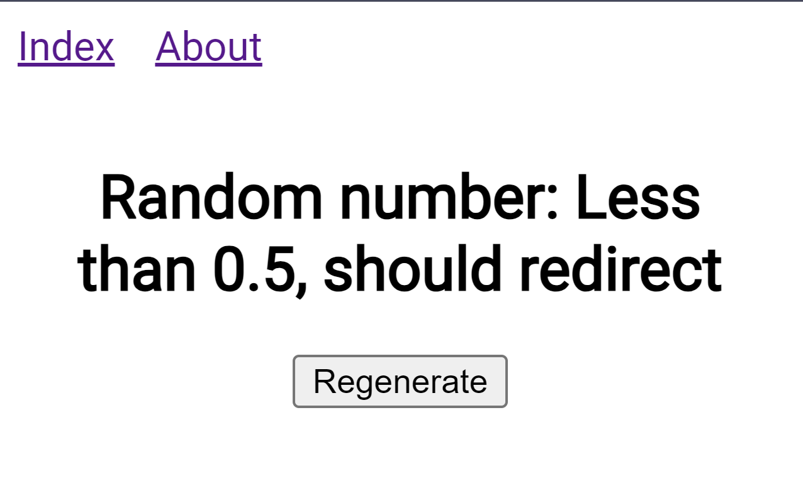

# SolidStart Repros

## Nested Cache Redirect

When a `cache` server function calls another `cache` server function, any redirects thrown inside the inner function are ignored an `undefined` is returned.

### Repro

1. Run this project
2. See the generated number. When the number is less than 0.5 the server throws a redirect which gets ignored.

3. Uncomment line 36 and comment line 39 in `src/routes/index.tsx`.
4. This time the redirect gets followed since it's no longer nested.
